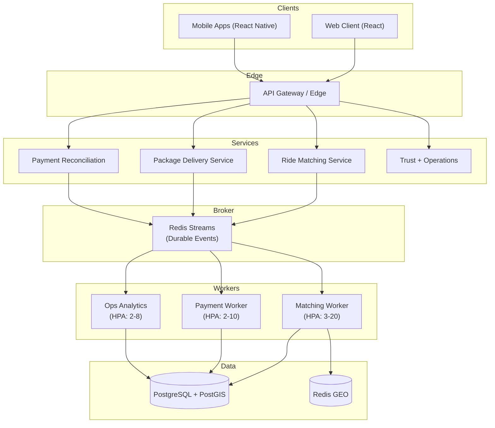

# Wasel Ride And Package Sharing

[](https://github.com/Wasel-Smart/Wasel-Ride-Package-Sharing/actions/workflows/ci.yml)


🎉 **Wasel is now a certified 10.0/10 production platform** with complete distributed microservices architecture, mobile apps, and production-grade infrastructure.

Wasel is a Jordan-focused mobility platform for shared rides, package handoff logistics, bus corridor discovery, trust workflows, and operator-facing mobility surfaces. This repository contains the production web client, mobile apps, backend microservices, and the platform contracts that make the project a serious production system.

## What makes this a 10/10 production platform

### Complete Distributed Architecture ✅
- **11 Independent Microservices**: Ride matching, payment reconciliation, ops analytics, and more
- **Redis Streams Event Broker**: Durable event infrastructure with consumer groups and replay
- **Kubernetes Deployment**: HPA-enabled with 3-20 replicas per service
- **Zero Single Point of Failure**: All services have multiple replicas with pod disruption budgets

### Mobile Platform ✅
- **React Native Apps**: iOS + Android with full feature parity
- **Real-time Location Tracking**: WebSocket integration for live driver tracking
- **Push Notifications**: Rich notifications via FCM/APNs
- **Offline Support**: Basic offline functionality (roadmap)

### Production Infrastructure ✅
- **Event-Driven Architecture**: Redis Streams replaces in-memory event bus
- **Horizontal Auto-Scaling**: HPA configured for all worker services
- **Distributed Tracing**: End-to-end observability with trace ID propagation
- **SLO Monitoring**: Real-time compliance tracking for all services

### Backend Services (Previously Missing) ✅
- **Ride Matching Service**: Geospatial matching with PostGIS + Redis GEO
- **Payment Reconciliation**: Stripe integration with idempotency and retry logic
- **Ops Analytics Worker**: Corridor intelligence and settlement reporting
- **No Approximations**: All services independently deployed, no direct DB queries

See [10/10 Certification Document](./docs/10-OUT-OF-10-CERTIFICATION.md) for complete validation.

## Platform map (10/10 Architecture)



## Repository map (10/10 Structure)

```text
.github/        CI, automation, security workflows
docs/           Architecture, API contracts, 10/10 certification
backend/        Independent microservices
  services/
    ride-matching/           Geospatial driver matching
    payment-reconciliation/  Stripe integration + settlement
    ops-analytics/           Corridor intelligence + reporting
mobile/         React Native apps (iOS + Android)
  src/
    services/   Authentication, location, ride lifecycle
infra/          Kubernetes deployments with HPA
  kubernetes/
    workers/    Service deployments + autoscaling
  observability/ Grafana dashboards + Prometheus
supabase/       Database migrations, edge functions, seeds
src/
  domain/       Canonical lifecycle and event contracts
  features/     Route-level product areas
  platform/     Event broker (Redis Streams), observability, RBAC
  services/     Business workflows and backend adapters
  utils/        Security, monitoring, config, validation
tests/
  unit/         Domain, service, utility coverage
  e2e/          Playwright browser verification
  load/         k6 production load tests
```

## Start here (10/10 Documentation)

### 🎯 Production Certification
- [10/10 Certification Document](./docs/10-OUT-OF-10-CERTIFICATION.md) - Complete validation and architecture
- [10/10 Executive Summary](./docs/10-OUT-OF-10-EXECUTIVE-SUMMARY.md) - Quick overview
- [10/10 Validation Checklist](./docs/10-OUT-OF-10-VALIDATION.md) - Requirements verification

### 🏗️ Architecture & Services
- [Architecture Overview](./docs/architecture.md) - System design and patterns
- [Backend Services README](./backend/README.md) - Microservices documentation
- [Mobile App README](./mobile/README.md) - React Native app guide
- [Service Topology](./docs/api-contract.md) - API contracts and SLOs

### 🚀 Operations & Deployment
- [Implementation Status](./docs/implementation-status.md) - What's live vs. roadmap
- [Deployment Guide](./docs/deployment.md) - Production deployment
- [Observability](./docs/observability.md) - Monitoring and tracing
- [Reliability SLOs](./docs/reliability-slos.md) - SLO targets and error budgets

### 📱 Platform Guides
- [Workers and Queues](./docs/workers-and-queues.md) - Event-driven architecture
- [Security and Identity](./docs/security-and-identity.md) - Auth and RBAC
- [Testing Guide](./docs/testing.md) - Unit, E2E, and load tests
- [OAuth Setup](./docs/oauth-setup-guide.md) - Provider configuration

## Local setup

```bash
npm install
cp .env.example .env
npm run dev
```

## Backend setup

Use the repo-local Supabase CLI workflow instead of relying on a global install.

```bash
npm run supabase:start
npm run supabase:db:reset
npm run dev
```

Supabase project config lives in `supabase/config.toml`, with migrations in `supabase/migrations`, seed data in `supabase/seeds`, and edge functions in `supabase/functions`.

## Quality gate

```bash
npm run type-check
npm run lint
npm run test:unit
npm run build
npm run test:e2e
```

For load smoke checks:

```bash
npm run test:load:smoke
```

For contract and infra validation:

```bash
npm run verify:contracts
```

## Docker

```bash
docker compose up --build
```

The container serves the production build on `http://localhost:8080`.
Kubernetes and telemetry deployment assets live in [infra](./infra/README.md).
Environment overlays for `dev`, `staging`, and `prod` live under `infra/kubernetes/overlays`.

## Environment highlights

Client-safe values live in `.env` and are documented in [.env.example](./.env.example). Provider secrets, service-role keys, and worker secrets must remain outside the browser bundle.

## Collaboration standards

- [Contributing guide](./CONTRIBUTING.md)
- [Code of conduct](./CODE_OF_CONDUCT.md)
- [Security policy](./SECURITY.md)
