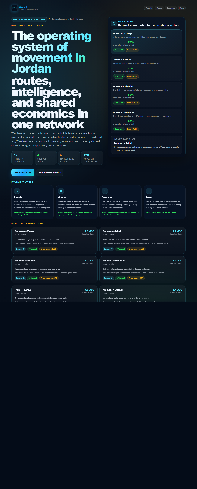
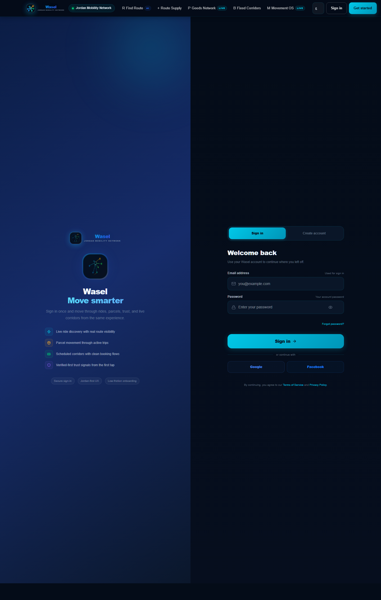

# Wasel Ride & Package Sharing

[](https://github.com/Wasel-Smart/Wasel-Ride-Package-Sharing/actions/workflows/ci.yml)


Wasel is a Jordan-focused mobility platform for shared rides, package handoff logistics, bus corridor discovery, trust workflows, and operator-facing mobility surfaces. This repository contains the production web client, Supabase assets, verification suites, and the operating docs required to ship changes safely.

## Why this repository reads like a production project

- Feature-oriented React 18 + TypeScript application with clear route boundaries
- Supabase-backed auth and data flows with explicit degraded-mode handling
- Browser, unit, lint, type-check, and production-build verification already wired in
- CI automation, issue templates, security policy, and contribution standards
- Architecture, launch, and testing documentation for engineering handoff

## Start here

- Read the [architecture overview](./docs/architecture.md) for the system shape.
- Read the [testing guide](./docs/testing.md) for the quality gate and local workflow.
- Browse the [docs index](./docs/README.md) for launch, rehearsal, and operational runbooks.
- Open [CONTRIBUTING.md](./CONTRIBUTING.md) and [SECURITY.md](./SECURITY.md) before sending changes upstream.

## Visual tour

| Home | Find ride | Package flow |
| --- | --- | --- |
|  |  |  |

Additional product captures live under [`docs/screenshots/review-screenshots`](./docs/screenshots/review-screenshots).

## Tech stack

| Layer | Technology |
| --- | --- |
| Frontend | React 18, TypeScript, Vite 6 |
| Routing | React Router 7 |
| Styling | Tailwind CSS 4 |
| Data and auth | Supabase |
| State and caching | TanStack Query |
| UI primitives | Radix UI |
| Monitoring | Sentry |
| Testing | Vitest, Playwright |

## Repository map

```text
.github/        Workflow automation and contribution templates
docs/           Architecture, launch, and operational guides
public/         Static assets served by Vite
scripts/        Build and verification helpers
src/
  components/   Shared UI building blocks
  contexts/     Application-wide runtime state
  features/     Route-level product areas
  services/     Backend contract and fallback adapters
  utils/        Config, security, monitoring, and helpers
supabase/       Schema, migrations, and seed assets
tests/
  unit/         Unit and service coverage
  e2e/          Playwright end-to-end coverage
```

## Getting started

### Prerequisites

- Node.js 20.10+
- npm 10+

### Local setup

```bash
npm install
cp .env.example .env
npm run dev
```

The app expects client-safe `VITE_*` values in `.env`. Never commit local `.env` files or provider secrets.

## Core scripts

| Command | Purpose |
| --- | --- |
| `npm run dev` | Start the Vite development server |
| `npm run type-check` | Run TypeScript in no-emit mode |
| `npm run lint` | Enforce ESLint rules |
| `npm run test:unit` | Run Vitest unit and service tests |
| `npm run test:e2e` | Run Playwright browser tests |
| `npm run build` | Produce a production build and sync build output |
| `npm run verify:ci` | CI-grade quality gate |
| `npm run verify` | Full local verification including Playwright |

## Quality workflow

1. Make the change.
2. Run `npm run verify:ci`.
3. Run `npm run verify` if the change affects route behavior, auth, or browser flows.
4. Include screenshots for visible UI changes in the pull request.

The GitHub Actions workflow at [`.github/workflows/ci.yml`](./.github/workflows/ci.yml) runs the CI-grade gate on pushes to `master` and on pull requests.

## Documentation and operations

- [Docs index](./docs/README.md)
- [Architecture overview](./docs/architecture.md)
- [Testing guide](./docs/testing.md)
- [Launch rehearsal checklist](./docs/LAUNCH_REHEARSAL_CHECKLIST.md)
- [Production cutover checklist](./docs/PRODUCTION_CUTOVER_CHECKLIST.md)
- [Final delivery summary](./docs/FINAL_DELIVERY_SUMMARY.md)

## Environment highlights

See `.env.example` for the full list. The most important client-side values are:

- `VITE_SUPABASE_URL`
- `VITE_SUPABASE_ANON_KEY`
- `VITE_EDGE_FUNCTION_NAME`
- `VITE_APP_URL`
- `VITE_SUPPORT_WHATSAPP_NUMBER`
- `VITE_ENABLE_TWO_FACTOR_AUTH`
- `VITE_ALLOW_DIRECT_SUPABASE_FALLBACK`

Server-side secrets such as `SUPABASE_SERVICE_ROLE_KEY`, email provider keys, and Twilio credentials must remain outside the browser bundle.

## Collaboration standards

- [Contributing guide](./CONTRIBUTING.md)
- [Code of conduct](./CODE_OF_CONDUCT.md)
- [Security policy](./SECURITY.md)
