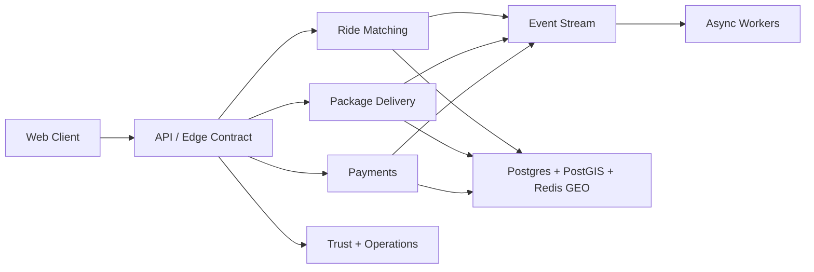

# Wasel Ride And Package Sharing

[](https://github.com/Wasel-Smart/Wasel-Ride-Package-Sharing/actions/workflows/ci.yml)


Wasel is a Jordan-focused mobility platform for shared rides, package handoff logistics, bus corridor discovery, trust workflows, and operator-facing mobility surfaces. This repository contains the production web client and the platform contracts that make the project review like a serious system rather than a demo.

## What changed the engineering bar

- Canonical domain modeling for rides, packages, and driver availability
- Typed domain events and an event-bus contract for async flows
- Queue and worker ownership contracts for matching, package, payment, notification, and ops workers
- Explicit service topology, SLO targets, and deployment overlays for dev, staging, and prod
- Standard API response envelopes with request tracing
- Structured observability primitives and Sentry integration
- Runtime environment validation plus dedicated GitHub security workflows
- Cross-platform CI with browser verification artifacts
- Dockerized SPA deployment and load-test scaffolding
- Expanded architecture, API, observability, worker, and scaling docs
- Kubernetes and observability deployment scaffolding in `infra/`

## Platform map



## Repository map

```text
.github/        CI, automation, templates
docs/           Architecture, OpenAPI, observability, launch docs
docker/         Nginx runtime configuration
scripts/        Build and verification helpers
supabase/       Local Supabase project, functions, migrations, and seeds
src/
  domain/       Canonical lifecycle and event contracts
  features/     Route-level product areas
  platform/     Event bus, API envelope, geo stream, RBAC, observability
  services/     Business workflows and backend adapters
  utils/        Security, monitoring, config, validation, performance
tests/
  unit/         Domain, service, and utility coverage
  e2e/          Playwright browser verification
  load/         k6 smoke tests
```

## Start here

- [Wiring Quick Reference](./WIRING_QUICK_REFERENCE.md) ⭐ **START HERE**
- [Architecture](./docs/architecture.md)
- [Wiring Architecture](./docs/WIRING_ARCHITECTURE.md) ⭐ **NEW**
- [API contract](./docs/api-contract.md)
- [OAuth Setup Guide](./docs/oauth-setup-guide.md) ⭐ **NEW**
- [OAuth Setup Checklist](./docs/oauth-setup-checklist.md) ⭐ **NEW**
- [Security and identity](./docs/security-and-identity.md)
- [Observability](./docs/observability.md)
- [Reliability SLOs](./docs/reliability-slos.md)
- [Workers and queues](./docs/workers-and-queues.md)
- [Testing](./docs/testing.md)
- [Docs index](./docs/README.md)

## Local setup

```bash
npm install
cp .env.example .env
npm run dev
```

## Backend setup

Use the repo-local Supabase CLI workflow instead of relying on a global install.

```bash
npm run supabase:start
npm run supabase:db:reset
npm run dev
```

Supabase project config lives in `supabase/config.toml`, with migrations in `supabase/migrations`, seed data in `supabase/seeds`, and edge functions in `supabase/functions`.

## Quality gate

```bash
npm run type-check
npm run lint
npm run test:unit
npm run build
npm run test:e2e
```

For load smoke checks:

```bash
npm run test:load:smoke
```

For contract and infra validation:

```bash
npm run verify:contracts
```

## Docker

```bash
docker compose up --build
```

The container serves the production build on `http://localhost:8080`.
Kubernetes and telemetry deployment assets live in [infra](./infra/README.md).
Environment overlays for `dev`, `staging`, and `prod` live under `infra/kubernetes/overlays`.

## Environment highlights

Client-safe values live in `.env` and are documented in [.env.example](./.env.example). Provider secrets, service-role keys, and worker secrets must remain outside the browser bundle.

## Collaboration standards

- [Contributing guide](./CONTRIBUTING.md)
- [Code of conduct](./CODE_OF_CONDUCT.md)
- [Security policy](./SECURITY.md)
