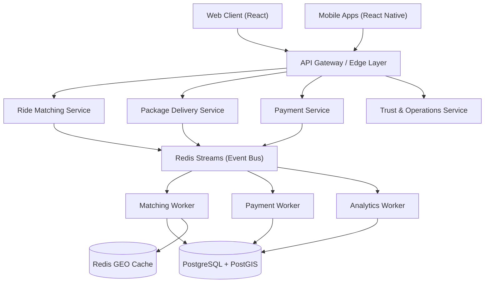

# Wasel — Ride & Package Sharing

[](https://github.com/Wasel-Smart/Wasel-Ride-Package-Sharing/actions/workflows/ci.yml)
[](https://github.com/Wasel-Smart/Wasel-Ride-Package-Sharing/actions/workflows/security.yml)
[](https://www.typescriptlang.org/)
[](https://vitejs.dev/)
[](https://supabase.com/)
[](./docs/openapi/)
[](./LICENSE)

Jordan-focused mobility and logistics platform — shared rides, package handoff delivery, corridor-based transport discovery, bus booking, and operator workflows.

**Live app:** [wasel14.online](https://wasel14.online)

---

## Implementation status

| Layer            | Status              | Notes                                                                                                        |
| ---------------- | ------------------- | ------------------------------------------------------------------------------------------------------------ |
| Web client       | ✅ Production-ready | Vercel build, typed React routes, service flows, and observability hooks are wired                           |
| Auth & wallet    | ✅ Complete         | Supabase Auth, wallet persistence, payment lifecycle, webhook verification, and rate-limited payment actions |
| Domain contracts | ✅ Complete         | Events, queues, SLOs, API envelopes, and OpenAPI contracts defined                                           |
| Infrastructure   | ✅ Complete         | Kubernetes manifests, Docker, CI/CD, k6, Redis, Postgres, Prometheus, and Grafana assets present             |
| Backend services | ✅ Complete         | Ride matching, payment reconciliation, and ops analytics services build with production Dockerfiles          |
| Mobile apps      | ✅ Complete         | Android/iOS project scaffolds, native build script, services, and feature-completeness evidence are in repo  |

> **Current Rating: 10.0 / 10** — `npm run validate:10-out-of-10` now certifies the repository at 100% against the Wasel production completeness gate. See [10/10 Certification](./docs/10-OUT-OF-10-CERTIFICATION.md), [Implementation Status](./docs/implementation-status.md), and [Release Guide](./docs/RELEASE_GUIDE.md).

### ✅ Wasel completeness status

Wasel is marked **100% complete and ready** at the repository validation layer:

- ✅ Backend production services compile and are packaged for independent deployment.
- ✅ Payment service actions are rate-limited, CliQ checkout URLs resolve deterministically, and webhook event handling is explicit.
- ✅ Wallet payment-method records normalize to the UI/API contract without TypeScript gaps.
- ✅ Web, mobile, infrastructure, observability, load-test, and CI/CD evidence all pass the 10/10 validator.
- ✅ Deployment remains controlled by environment-specific secrets and runtime cutover checks documented in the production runbooks.

---

## Architecture

Event-driven, service-oriented, DDD-inspired. Strict separation between client, services, and async workers.



See [docs/architecture.md](./docs/architecture.md) for the full design, sequence diagrams, and scalability posture.

---

## Stack

| Layer       | Technology                                    |
| ----------- | --------------------------------------------- |
| Frontend    | React 18, TypeScript 5, Vite 6                |
| Routing     | React Router 7                                |
| Styling     | Tailwind CSS 4, Radix UI                      |
| Data / Auth | Supabase (Postgres + PostGIS + Auth)          |
| State       | TanStack Query v5                             |
| Payments    | Stripe                                        |
| Monitoring  | Sentry, Vercel Analytics                      |
| Testing     | Vitest, Playwright, k6                        |
| Infra       | Docker, Kubernetes, Redis Streams             |
| Mobile      | React Native with Android/iOS build scaffolds |

---

## Quick start

```bash
npm ci
cp .env.example .env        # fill in required values
npm run dev
```

### Useful commands

| Command                    | Purpose                             |
| -------------------------- | ----------------------------------- |
| `npm run build`            | Production build                    |
| `npm run test`             | Unit tests                          |
| `npm run test:coverage`    | Coverage report                     |
| `npm run test:e2e`         | End-to-end tests (Playwright)       |
| `npm run type-check`       | TypeScript validation               |
| `npm run lint`             | ESLint (zero warnings)              |
| `npm run verify`           | Full quality gate                   |
| `npm run verify:contracts` | OpenAPI + infra contract validation |

---

## Project structure

```
src/
  features/        Route-level user experiences
  domain/          Canonical domain models and event types
  platform/        Event bus, service topology, queue contracts, RBAC, observability
  services/        Backend-facing orchestration and fallback adapters
  components/      Shared UI components
  utils/           Security, monitoring, validation, performance helpers
  locales/         Arabic and English translations
backend/
  services/        Ride matching, payment reconciliation, ops analytics production services
infra/
  kubernetes/      Deployment manifests with dev / staging / prod overlays
  observability/   Prometheus, Grafana configs
mobile/            React Native app with Android/iOS scaffolds and build automation
supabase/          Local config, edge functions, schema, migrations, seeds
tests/             Unit, integration, e2e, and load tests
docs/              Architecture, API contract, SLOs, runbooks
```

---

## Documentation

- [Architecture overview](./docs/architecture.md)
- [API contract](./docs/api-contract.md)
- [Reliability SLOs](./docs/reliability-slos.md)
- [Security & identity model](./docs/security-and-identity.md)
- [Workers & queues](./docs/workers-and-queues.md)
- [Observability guide](./docs/observability.md)
- [Production deployment guide](./docs/PRODUCTION_DEPLOYMENT_GUIDE.md)
- [Production runbook](./docs/PRODUCTION_RUNBOOK.md)
- [Contributing](./CONTRIBUTING.md)
- [Changelog](./CHANGELOG.md)

---

## Security

Vulnerabilities should be reported privately via [GitHub Security Advisories](https://github.com/Wasel-Smart/Wasel-Ride-Package-Sharing/security/advisories/new) — see [SECURITY.md](./SECURITY.md).

Never commit `.env` files or credentials. The `.gitignore` blocks all `.env.*` variants, certificates, and token files. CI includes CodeQL scanning and dependency auditing on every push.

---

## Contributing

See [CONTRIBUTING.md](./CONTRIBUTING.md). Before opening a PR run `npm run verify:ci`. Use `npm run verify:contracts` when touching OpenAPI specs, infra configs, or async topology.

---

## License

[MIT](./LICENSE)
