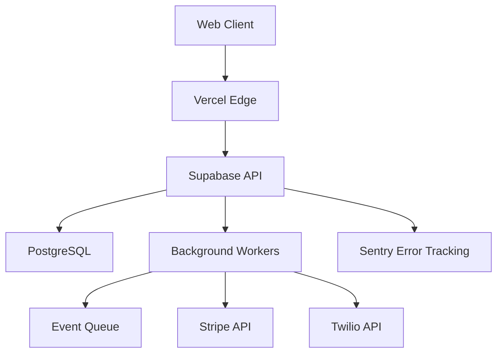

# Production Runbook

This runbook provides operational procedures for running Wasel in production, including incident response, routine maintenance, and troubleshooting.

## Table of Contents

1. [System Architecture Overview](#system-architecture-overview)
2. [On-Call Procedures](#on-call-procedures)
3. [Incident Response](#incident-response)
4. [Common Issues & Resolutions](#common-issues--resolutions)
5. [Maintenance Procedures](#maintenance-procedures)
6. [Rollback Procedures](#rollback-procedures)
7. [Monitoring & Alerting](#monitoring--alerting)
8. [Escalation Paths](#escalation-paths)

---

## System Architecture Overview

### Core Components
- **Web Client**: React SPA hosted on Vercel (CDN + Edge Network)
- **API Gateway**: Supabase Edge Functions (Deno runtime)
- **Database**: PostgreSQL + PostGIS on Supabase
- **Real-time**: WebSocket connections for geo-streaming
- **Workers**: Async job processing (matching, notifications, payments)
- **External Services**: Stripe (payments), Twilio (SMS), SendGrid (email)

### System Dependencies


---

## On-Call Procedures

### Response Times
- **P0 (Critical)**: 15 minutes
- **P1 (High)**: 1 hour
- **P2 (Medium)**: 4 hours
- **P3 (Low)**: Next business day

### First Response Checklist
1. Acknowledge the alert in PagerDuty/monitoring system
2. Check the observability dashboard: `https://wasel.jo/ops/observability`
3. Review Sentry for recent error spikes
4. Check #incidents Slack channel for context
5. Begin initial investigation

---

## Incident Response

### P0: Critical Outage (Site Down / Payment Failures)

#### Symptoms
- API returning 5xx errors > 10%
- Database connection failures
- Payment capture rate < 90%
- Complete service unavailability

#### Investigation Steps
1. **Check System Status**
   ```bash
   curl https://wasel.jo/health
   curl https://api.wasel.jo/health
   ```

2. **Check Vercel Status**
   - Visit: https://vercel-status.com
   - Check deployment logs: `vercel logs --prod`

3. **Check Supabase Status**
   ```bash
   npx supabase status
   # Check connection pool
   SELECT count(*) FROM pg_stat_activity;
   ```

4. **Check Database Performance**
   ```sql
   -- Long-running queries
   SELECT pid, now() - pg_stat_activity.query_start AS duration, query 
   FROM pg_stat_activity 
   WHERE state = 'active' AND now() - pg_stat_activity.query_start > interval '1 minute';

   -- Kill problematic query if needed
   SELECT pg_terminate_backend(pid);
   ```

5. **Check Error Rates in Sentry**
   - Go to: https://sentry.io/organizations/wasel/issues/
   - Filter by: Last 1 hour, Environment: Production

#### Resolution Steps
1. **If deployment-related**: Rollback immediately
   ```bash
   vercel rollback --prod
   ```

2. **If database-related**: Scale database resources in Supabase dashboard

3. **If external service**: Check Stripe/Twilio status pages, enable fallback mode

4. **If rate limiting**: Temporarily increase rate limits in edge function config

#### Communication Template
```
🚨 INCIDENT: [Title]
Status: Investigating
Impact: [% of users affected]
Started: [Time]
ETA: [Estimated resolution time]

Current Actions:
- [Action 1]
- [Action 2]

Updates every 15 minutes or on significant change.
```

---

### P1: High Severity (Degraded Performance)

#### Symptoms
- API latency p95 > SLO targets
- Queue lag > 60 seconds
- Error rate 1-10%
- Worker circuit breakers opening

#### Investigation Steps
1. **Check Telemetry Dashboard**
   - Navigate to: `/ops/observability`
   - Review SLO compliance metrics

2. **Check Queue Health**
   ```sql
   SELECT topic, COUNT(*) as pending_count, 
          AVG(EXTRACT(EPOCH FROM (NOW() - created_at))) as avg_age_seconds
   FROM queue_messages 
   WHERE status = 'pending'
   GROUP BY topic;
   ```

3. **Check Worker Health**
   ```bash
   # View worker logs
   npx supabase functions logs matching-worker --tail
   ```

4. **Check Database Query Performance**
   ```sql
   SELECT query, calls, total_time, mean_time, max_time
   FROM pg_stat_statements
   ORDER BY mean_time DESC
   LIMIT 20;
   ```

#### Resolution Steps
1. Scale worker concurrency if queue is backed up
2. Add database indexes for slow queries
3. Enable caching for hot paths
4. Temporarily disable non-critical features

---

### P2: Medium Severity (Feature Degradation)

#### Symptoms
- Specific feature failing (notifications, tracking)
- Single region affected
- External service degradation

#### Standard Procedure
1. Isolate the failing component
2. Enable circuit breaker to prevent cascading failures
3. Monitor error rates and queue depths
4. Schedule fix for next deployment window

---

## Common Issues & Resolutions

### Issue: Database Connection Pool Exhausted

**Symptoms**: `remaining connection slots are reserved` errors

**Resolution**:
```sql
-- Check current connections
SELECT count(*) FROM pg_stat_activity;

-- Kill idle connections
SELECT pg_terminate_backend(pid) 
FROM pg_stat_activity 
WHERE state = 'idle' 
AND state_change < current_timestamp - INTERVAL '10 minutes';
```

Adjust connection pool settings in Supabase dashboard.

---

### Issue: High API Latency

**Symptoms**: p95 latency > 500ms

**Resolution**:
1. Check for N+1 queries in Supabase logs
2. Review recent code changes that might affect performance
3. Enable query caching for frequently accessed data
4. Scale up database resources if CPU > 80%

---

### Issue: Worker Circuit Breaker Open

**Symptoms**: `Circuit breaker is open` in worker logs

**Resolution**:
1. Check external service status (Stripe, Twilio, SendGrid)
2. Verify worker configuration and retry policies
3. Manually reset circuit breaker:
   ```typescript
   // In admin console
   await workerRegistry.getWorker('matching-worker')?.resetCircuitBreaker();
   ```

---

### Issue: Payment Processing Failures

**Symptoms**: Stripe webhook errors, payment capture failures

**Resolution**:
1. Check Stripe dashboard for failed charges
2. Verify webhook signature validation
3. Check for expired payment methods
4. Review recent Stripe API changes

---

## Maintenance Procedures

### Database Migrations

1. **Pre-migration checklist**:
   - [ ] Backup database
   - [ ] Test migration on staging
   - [ ] Schedule maintenance window
   - [ ] Notify users of potential downtime

2. **Execute migration**:
   ```bash
   npx supabase db push --dry-run
   npx supabase db push
   ```

3. **Post-migration verification**:
   ```sql
   -- Verify schema changes
   \d table_name

   -- Check for broken queries
   SELECT * FROM pg_stat_statements WHERE calls > 0 ORDER BY total_time DESC LIMIT 10;
   ```

---

### Scaling Procedures

#### Scale Database
1. Navigate to Supabase dashboard
2. Project Settings > Database
3. Adjust compute resources based on load
4. Monitor performance for 15 minutes post-scale

#### Scale Workers
Update worker concurrency in configuration:
```typescript
// src/platform/worker-framework.ts
config: {
  concurrency: 20, // Increase from 10
}
```

---

## Rollback Procedures

### Web Application Rollback
```bash
# Via Vercel CLI
vercel rollback --prod

# Or via Vercel Dashboard
# 1. Go to Deployments
# 2. Find last stable deployment
# 3. Click "..." > "Promote to Production"
```

### Database Migration Rollback
```bash
# If migration has down() function
npx supabase db reset --version <previous_version>

# Manual rollback
psql $DATABASE_URL < backups/rollback_<timestamp>.sql
```

### Edge Function Rollback
```bash
npx supabase functions deploy <function-name> --no-verify-jwt
```

---

## Monitoring & Alerting

### Key Metrics to Monitor

1. **API Health**
   - Request rate (requests/sec)
   - Error rate (5xx/total)
   - Latency (p50, p95, p99)

2. **Database Health**
   - Connection pool usage
   - Query performance
   - Replication lag (if applicable)

3. **Worker Health**
   - Queue depth
   - Processing latency
   - Error rate
   - Circuit breaker state

4. **Business Metrics**
   - Active rides/deliveries
   - Payment success rate
   - User registrations
   - Driver availability

### Alert Thresholds

| Metric | Warning | Critical |
|--------|---------|----------|
| API Error Rate | > 1% | > 5% |
| API p95 Latency | > 500ms | > 1000ms |
| Queue Lag | > 30s | > 60s |
| DB Connection Pool | > 80% | > 95% |
| Worker Failures | > 5% | > 20% |
| Payment Failures | > 2% | > 5% |

---

## Escalation Paths

### L1: On-Call Engineer
- Initial response and triage
- Execute standard runbook procedures
- Resolve common issues

### L2: Senior Engineer
- Complex debugging
- Database performance tuning
- Architecture decisions

### L3: Platform Team Lead
- Critical outages
- Multi-service failures
- Executive communication

### L4: CTO / External Vendors
- Major incidents
- Third-party service outages
- Legal/compliance issues

---

## Emergency Contacts

| Role | Primary | Backup |
|------|---------|--------|
| On-Call Engineer | PagerDuty Rotation | Slack #incidents |
| Database Admin | [Name] | [Name] |
| Platform Lead | [Name] | [Name] |
| CTO | [Name] | - |

---

## Post-Incident Procedures

After resolving an incident:

1. **Update status page**: Mark incident as resolved
2. **Post-mortem**: Schedule within 48 hours
3. **Document learnings**: Update this runbook
4. **Create action items**: Prevent recurrence
5. **Communicate resolution**: Notify stakeholders

### Post-Mortem Template

```markdown
# Incident Post-Mortem: [Title]

**Date**: [Date]
**Duration**: [Start - End]
**Severity**: [P0/P1/P2/P3]
**Incident Commander**: [Name]

## Summary
[Brief description of what happened]

## Impact
- Users affected: [Number or %]
- Revenue impact: [If applicable]
- Duration: [Time]

## Timeline
- [Time]: Incident began
- [Time]: First alert
- [Time]: Engineer responded
- [Time]: Root cause identified
- [Time]: Fix deployed
- [Time]: Incident resolved

## Root Cause
[Technical explanation]

## Resolution
[What fixed it]

## Action Items
- [ ] [Preventive measure 1]
- [ ] [Preventive measure 2]
- [ ] [Documentation update]

## Lessons Learned
[What we learned]
```

---

## Additional Resources

- [Architecture Documentation](./architecture.md)
- [API Contract](./api-contract.md)
- [Observability Guide](./observability.md)
- [Security Procedures](./security-and-identity.md)
- [Supabase Dashboard](https://app.supabase.com)
- [Vercel Dashboard](https://vercel.com/dashboard)
- [Sentry Dashboard](https://sentry.io)
