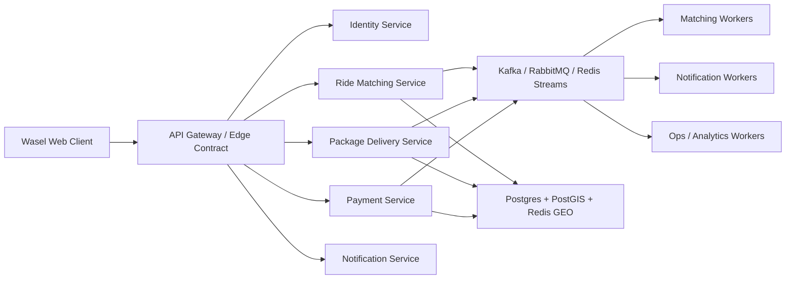
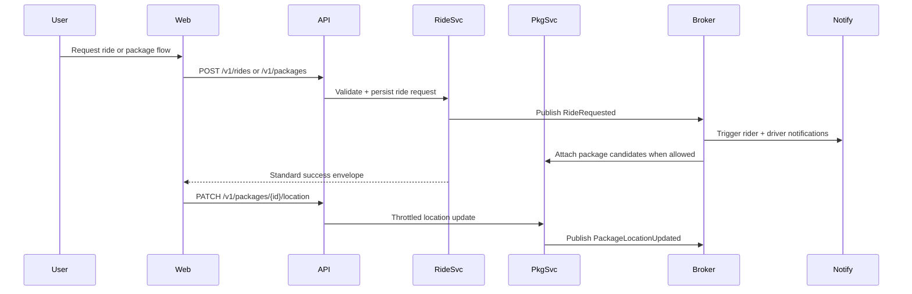

# Architecture Overview

Wasel is a mobility platform, not just a React frontend. This repository contains the production web client plus the contracts, domain models, verification assets, and operating documentation required to run a ride-sharing and package-delivery system with credible production posture.

## System shape

The codebase is organized around bounded contexts and production concerns:

- `src/features`: route-level user experiences
- `src/services`: backend-facing orchestration, fallback adapters, and business workflows
- `src/domain`: canonical ride, package, driver, and event models
- `src/platform`: event bus, API envelope, geo-stream throttling, observability, and RBAC primitives
- `src/platform/service-topology.ts`: explicit service catalog, ownership, and SLO posture
- `src/utils`: security, monitoring, configuration, validation, and performance helpers
- `supabase`: local project config, edge functions, schema, migrations, and seed artifacts
- `tests`: unit, service, browser, and load-testing assets
- `infra`: Kubernetes, worker, and observability deployment scaffolding

## Bounded contexts

### Identity and access

- Supabase Auth is the identity provider.
- RBAC primitives live in `src/platform/rbac.ts`.
- The expected service-side roles are `admin`, `operator`, `driver`, and `user`.
- Browser code only receives client-safe tokens and client-safe `VITE_*` configuration.

### Ride matching

- Canonical ride lifecycle lives in `src/domain/rides/lifecycle.ts`.
- UI-facing booking states remain backward-compatible, but the service layer now projects them into canonical ride states:
  - `requested -> matched -> accepted -> in_progress -> completed -> cancelled`
- `src/services/rideLifecycle.ts` emits domain events as bookings progress.

### Package delivery

- Canonical package lifecycle lives in `src/domain/packages/lifecycle.ts`.
- Package flows are modeled as:
  - `created -> assigned -> picked_up -> in_transit -> delivered -> cancelled`
- `src/services/packageTrackingService.ts` now tracks escrow, lifecycle state, delivery proofs, and location history.

### Driver availability

- Driver supply state is modeled in `src/domain/drivers/availability.ts`.
- The target lifecycle is:
  - `offline -> available -> reserved -> on_trip -> cooldown`

### Payments

- Browser-side payment orchestration currently supports wallet and Stripe-facing flows.
- Package escrow and release events are explicit domain events.
- Server-side payment capture and reconciliation remain backend responsibilities.

### Notifications and communications

- Push, in-app, and operational communications remain separate concerns.
- This repo expects asynchronous delivery infrastructure behind the API boundary for email, SMS, and WhatsApp workers.

## Event-driven contract

Wasel is designed around domain events even where the current deployment remains primarily frontend plus Supabase:

- `RideRequested`
- `DriverAssigned`
- `RideAccepted`
- `RideStarted`
- `RideCompleted`
- `RideCancelled`
- `PackageCreated`
- `PackageAssigned`
- `PackagePickedUp`
- `PackageDelivered`
- `PackageLocationUpdated`
- `PaymentAuthorized`
- `PaymentCaptured`

The in-repo typed event contract lives in `src/domain/events.ts`, and the runtime bus lives in `src/platform/event-bus.ts`.
Queue ownership and worker responsibilities live in [workers-and-queues.md](./workers-and-queues.md), `src/platform/queue-contracts.ts`, and `src/platform/service-topology.ts`.

## Target service topology

## Runtime flow

## Scalability posture

- APIs are designed to remain stateless.
- Heavy work is assumed to move to async workers:
  - driver matching
  - notifications
  - payment reconciliation
  - operations analytics
- Geo updates are throttled by `src/platform/geo-stream.ts`.
- Canonical API envelopes support consistent retries and failure handling.
- The repo now includes browser, unit, and load-test assets so throughput assumptions are testable.
- Deployment scaffolding for web and worker services lives under `infra/kubernetes`.
- Environment-specific overlays for `dev`, `staging`, and `prod` live under `infra/kubernetes/overlays`.

## Security posture

- Client-side rate limiting and input validation live in `src/utils/security.ts` and `src/utils/validation.ts`.
- Secrets stay outside the browser bundle.
- Production direct-write fallbacks fail closed unless explicitly enabled.
- The recommended backend contract uses versioned `/v1/` endpoints with centralized auth and rate limiting at the gateway.
- Static hosting headers are hardened in `docker/nginx.conf` to document the target CSP, HSTS, permissions, and caching policy.

## Observability posture

- Structured client logging: `src/platform/observability.ts`
- Error capture and metrics breadcrumbs: `src/utils/monitoring.ts`
- Sentry: runtime error monitoring
- Architecture docs for Prometheus/Grafana, OpenTelemetry, and centralized logging: see [observability.md](./observability.md)

## Verification posture

- Type safety: `npm run type-check`
- Static analysis: `npm run lint`
- Unit and service verification: `npm run test:unit`
- Browser verification: `npm run test:e2e`
- Contract and infra verification: `npm run verify:contracts`
- Load smoke test: `npm run test:load:smoke`
- CI workflow: `.github/workflows/ci.yml`
- Security workflow: `.github/workflows/security.yml`

## Tradeoffs

- This repo still ships as one web client repository, but the internal contracts now reflect service boundaries instead of a monolithic mental model.
- Some backend capabilities are represented as typed contracts and docs because the secure server runtime is not fully implemented inside this repo.
- UI compatibility was preserved while upgrading lifecycle modeling under the hood.
