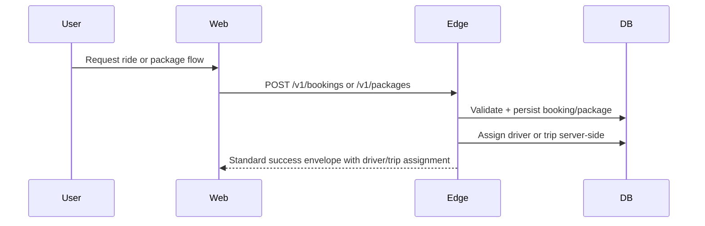

# Architecture Overview

Wasel is a Jordan-focused mobility platform built as a React SPA with a Supabase backend and a single monolithic Edge Function for server-side logic. This document describes the actual production architecture, not an aspirational target state.

## System shape

The codebase is organized around product features and production concerns:

- `src/features`: route-level user experiences
- `src/services`: backend-facing orchestration, fallback adapters, and business workflows
- `src/domain`: canonical ride, package, driver, and event models
- `src/platform`: event bus, API envelope, geo-stream throttling, observability, and RBAC primitives
- `supabase`: local project config, edge functions, schema, migrations, and seed artifacts
- `tests`: unit, service, browser, and load-testing assets
- `k8s`: Kubernetes deployment manifests for Redis, Postgres, and API server

## Bounded contexts

### Identity and access

- Supabase Auth is the identity provider.
- RBAC primitives live in `src/platform/rbac.ts`.
- The expected service-side roles are `admin`, `operator`, `driver`, and `user`.
- Browser code only receives client-safe tokens and client-safe `VITE_*` configuration.

### Ride matching

- Canonical ride lifecycle lives in `src/domain/rides/lifecycle.ts`.
- Server-side matching is handled by the Edge Function when a booking is created (`POST /v1/bookings`). The edge function assigns an available driver directly in the same request.
- `src/services/rideLifecycle.ts` emits domain events as bookings progress.

### Package delivery

- Canonical package lifecycle lives in `src/domain/packages/lifecycle.ts`.
- Package flows are modeled as:
  - `created -> assigned -> picked_up -> in_transit -> delivered -> cancelled`
- Server-side package assignment is handled by the Edge Function when a package is created (`POST /v1/packages`).
- `src/services/packageTrackingService.ts` tracks escrow, lifecycle state, delivery proofs, and location history.

### Driver availability

- Driver supply state is modeled in `src/domain/drivers/availability.ts`.
- The target lifecycle is:
  - `offline -> available -> reserved -> on_trip -> cooldown`

### Payments

- Browser-side payment orchestration currently supports wallet and Stripe-facing flows.
- Server-side payment capture and reconciliation are handled by the Edge Function and Stripe webhooks (`/v1/payments/webhooks/stripe`).
- Package escrow and release events are explicit domain events.

### Notifications and communications

- Push, in-app, and operational communications remain separate concerns.
- The Edge Function handles email (Resend/SendGrid), SMS and WhatsApp (Twilio), and push notifications directly in request handlers and webhooks.
- In-app notification toasts use the in-process event broker for same-tab real-time updates.

## Runtime flow

```mermaid
sequenceDiagram
  participant User
  participant Web
  participant Edge
  participant DB

  User->>Web: Request ride or package flow
  Web->>Edge: POST /v1/bookings or /v1/packages
  Edge->>DB: Validate + persist booking/package
  Edge->>DB: Assign driver or trip server-side
  Edge-->>Web: Standard success envelope with driver/trip assignment
```

## Scalability posture

- APIs are designed to remain stateless.
- Heavy work is handled synchronously in the Edge Function during the request path:
  - driver matching during booking creation
  - package assignment during package creation
  - payment reconciliation via webhooks
- Geo updates are throttled by `src/platform/geo-stream.ts`.
- Canonical API envelopes support consistent retries and failure handling.
- The repo includes browser, unit, and load-test assets so throughput assumptions are testable.
- Kubernetes deployment manifests live under `k8s/`.

## Security posture

- Client-side rate limiting and input validation live in `src/utils/security.ts` and `src/utils/validation.ts`.
- Secrets stay outside the browser bundle.
- Production direct-write fallbacks fail closed unless explicitly enabled.
- The API uses versioned `/v1/` endpoints with centralized auth and rate limiting at the edge.
- Static hosting headers are hardened in `vercel.json` to document the target CSP, HSTS, permissions, and caching policy.

## Observability posture

- Structured client logging: `src/platform/observability.ts`
- Error capture and metrics breadcrumbs: `src/utils/monitoring.ts`
- Sentry: runtime error monitoring
- Architecture docs for Prometheus/Grafana, OpenTelemetry, and centralized logging: see [observability.md](./observability.md)

## Verification posture

- Type safety: `npm run type-check`
- Static analysis: `npm run lint`
- Unit and service verification: `npm run test:unit`
- Browser verification: `npm run test:e2e`
- Contract and infra validation: `npm run verify:contracts`
- Load smoke test: `npm run test:load:smoke`
- CI workflow: `.github/workflows/ci.yml`
- Security workflow: `.github/workflows/security.yml`

## Tradeoffs

- This repo ships as one web client repository with a single Edge Function backend. The internal contracts reflect service boundaries, but the runtime is a monolithic edge function for operational simplicity.
- Async processing is handled server-side by the edge function during request handling, not by separate worker services. This is a conscious tradeoff for the Supabase + Vercel deployment model.
- The in-process event broker (`src/platform/event-bus.ts`) remains for same-tab real-time UI updates and cross-component communication. It is not a replacement for server-side processing.
