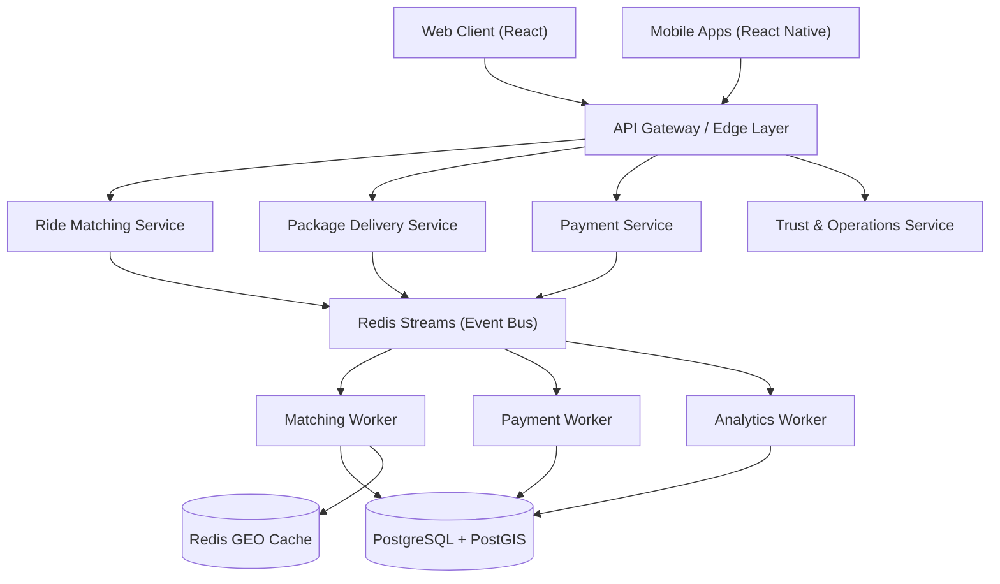

# Wasel Architecture

## Overview

Wasel uses an event-driven, service-oriented architecture with DDD-inspired domain separation.

## System Diagram

```mermaid
flowchart TB
  Web["Web Client (React)"]
  Mobile["Mobile Apps (React Native)"]
  Gateway["API Gateway / Edge Layer"]
  Ride["Ride Matching Service"]
  Package["Package Delivery Service"]
  Payment["Payment Service"]
  Trust["Trust & Operations Service"]
  EventBus["Redis Streams (Event Bus)"]
  MatchWorker["Matching Worker"]
  PayWorker["Payment Worker"]
  OpsWorker["Analytics Worker"]
  DB[(PostgreSQL + PostGIS)]
  Geo[(Redis GEO Cache)]

  Web --> Gateway
  Mobile --> Gateway
  Gateway --> Ride & Package & Payment & Trust
  Ride & Package & Payment --> EventBus
  EventBus --> MatchWorker & PayWorker & OpsWorker
  MatchWorker & PayWorker & OpsWorker --> DB
  MatchWorker --> Geo
```

## Layers

| Layer | Technology | Purpose |
|-------|------------|---------|
| Frontend | React 18, TypeScript 5, Vite 6 | User experience |
| Routing | React Router 7 | Navigation |
| Styling | Tailwind CSS 4, Radix UI | Design system |
| Data/Auth | Supabase (Postgres + PostGIS + Auth) | Persistence |
| State | TanStack Query v5 | Server state |
| Payments | Stripe | Payment processing |
| Monitoring | Sentry, Vercel Analytics | Observability |
| Testing | Vitest, Playwright, k6 | Quality gate |
| Infra | Docker, Kubernetes, Redis Streams | Deployment |

## Event Flow

1. **Ride Request** → `rides.requested` event published to Redis Streams
2. **Matching Worker** → consumes, scores drivers within 5km radius
3. **Driver Reservation** → atomic update on `driver_availability` table
4. **Ride Assigned** → `rides.assigned` event with match result

## Scalability Posture

- Horizontal pod autoscaling (3-20 replicas per service)
- Redis GEO for location indexing
- Connection pooling (10-20 connections per service)
- Graceful shutdown on SIGTERM
- Health probes: `/health` (liveness), `/ready` (readiness)

---