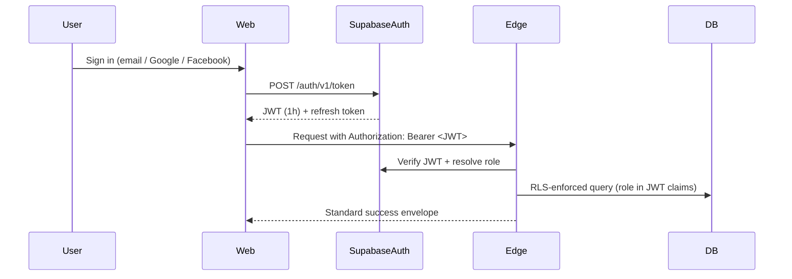
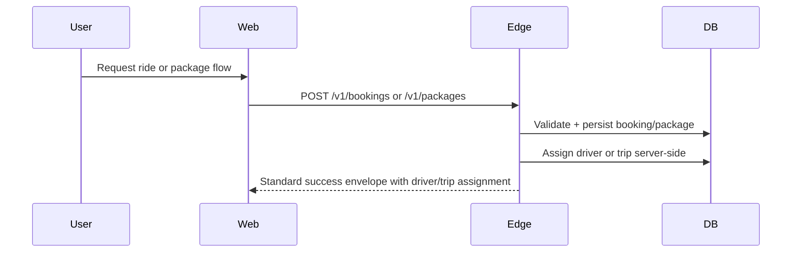

# Architecture Overview

Wasel is a Jordan and Iraq-focused mobility platform built as a React SPA with a Supabase backend. This document describes the actual production architecture, not an aspirational target state.

---

## System shape

The production runtime is a **React SPA (Vercel) + Supabase Edge Function (Deno)**. The internal contracts reflect full microservice boundaries, but the current deployment model uses a single edge function for operational simplicity at the current scale. The Kubernetes manifests under `infra/k8s-draft/` represent the target scale-out topology.

The codebase is organized around product features and production concerns:

- `src/features` — route-level user experiences
- `src/services` — backend-facing orchestration, fallback adapters, and business workflows
- `src/domain` — canonical ride, package, driver, and event models
- `src/platform` — event bus, API envelope, geo-stream throttling, observability, RBAC, queue contracts, and service topology
- `supabase` — local project config, edge functions, schema, migrations, and seed artifacts
- `tests` — unit, service, browser, and load-testing assets
- `infra/k8s-draft` — Kubernetes deployment manifests for Redis, Postgres, and API server

---

## Bounded contexts

| Context | Domain models | Service | Worker | Queue topics owned |
|---|---|---|---|---|
| Identity | — | identity-service | — | — |
| Rides | `src/domain/rides/lifecycle.ts` | ride-matching-service | matching-worker | rides.requested, rides.assigned, rides.completed |
| Packages | `src/domain/packages/lifecycle.ts` | package-delivery-service | package-worker | packages.created, packages.location-updated, packages.delivered |
| Driver supply | `src/domain/drivers/availability.ts` | ride-matching-service | matching-worker | — |
| Payments | — | payment-service | payment-worker | payments.authorized, payments.captured |
| Communications | — | notification-service | notification-worker | notifications.dispatch |
| Operations | `src/domain/trust/` | trust-service | ops-worker | — |

### Identity and access

- Supabase Auth is the identity provider
- RBAC primitives live in `src/platform/rbac.ts`
- Expected service-side roles: `admin`, `operator`, `driver`, `user`
- Browser code only receives client-safe tokens and `VITE_*` configuration

### Ride matching

- Canonical ride lifecycle: `src/domain/rides/lifecycle.ts`
- States: `requested → matched → accepted → in_progress → completed / cancelled`
- Server-side matching is handled by the Edge Function when a booking is created (`POST /v1/bookings`)
- `src/services/rideLifecycle.ts` emits domain events as bookings progress

### Package delivery

- Canonical package lifecycle: `src/domain/packages/lifecycle.ts`
- States: `created → assigned → picked_up → in_transit → delivered / cancelled`
- Server-side package assignment is handled by the Edge Function when a package is created (`POST /v1/packages`)
- `src/services/packageTrackingService.ts` tracks escrow, lifecycle state, delivery proofs, and location history

### Driver availability

- Driver supply state: `src/domain/drivers/availability.ts`
- States: `offline → available → reserved → on_trip → cooldown`

### Payments

- Browser-side payment orchestration supports wallet and Stripe-facing flows
- Server-side payment capture and reconciliation are handled by the Edge Function and Stripe webhooks (`/v1/payments/webhooks/stripe`)
- Package escrow and release events are explicit domain events

### Notifications and communications

- Push, in-app, and operational communications are separate concerns
- The Edge Function handles email (Resend/SendGrid), SMS and WhatsApp (Twilio), and push notifications
- In-app notification toasts use the in-process event broker for same-tab real-time updates

---

## Auth flow

```mermaid
sequenceDiagram
  participant User
  participant Web
  participant SupabaseAuth
  participant Edge
  participant DB

  User->>Web: Sign in (email / Google / Facebook)
  Web->>SupabaseAuth: POST /auth/v1/token
  SupabaseAuth-->>Web: JWT (1h) + refresh token
  Web->>Edge: Request with Authorization: Bearer <JWT>
  Edge->>SupabaseAuth: Verify JWT + resolve role
  Edge->>DB: RLS-enforced query (role in JWT claims)
  Edge-->>Web: Standard success envelope
```

---

## Runtime flow

```mermaid
sequenceDiagram
  participant User
  participant Web
  participant Edge
  participant DB

  User->>Web: Request ride or package flow
  Web->>Edge: POST /v1/bookings or /v1/packages
  Edge->>DB: Validate + persist booking/package
  Edge->>DB: Assign driver or trip server-side
  Edge-->>Web: Standard success envelope with driver/trip assignment
```

---

## Scalability posture

- APIs are designed to remain stateless
- Heavy work is handled synchronously in the Edge Function during the request path:
  - driver matching during booking creation
  - package assignment during package creation
  - payment reconciliation via webhooks
- Geo updates are throttled by `src/platform/geo-stream.ts`
- Canonical API envelopes support consistent retries and failure handling
- The repo includes browser, unit, and load-test assets so throughput assumptions are testable
- Kubernetes deployment manifests live under `infra/k8s-draft/`

---

## Security posture

- Client-side rate limiting and input validation: `src/utils/security.ts` and `src/utils/validation.ts`
- Secrets stay outside the browser bundle — `VITE_*` prefix enforced
- Production direct-write fallbacks fail closed unless explicitly enabled
- The API uses versioned `/v1/` endpoints with centralized auth and rate limiting at the edge
- Static hosting headers are hardened in `docker/nginx.conf` (CSP, HSTS, permissions policy, caching)
- RLS enforced on all Postgres tables; `anon` role has no write access

Full threat model: [security-and-identity.md](./security-and-identity.md)

---

## Observability posture

- Structured client logging: `src/platform/observability.ts`
- Error capture and metrics breadcrumbs: `src/utils/monitoring.ts`
- Sentry: runtime error monitoring
- App Insights: client metrics
- Grafana dashboard: `.github/workflows/grafana-dashboard-wasel-overview.json`
- Architecture docs for Prometheus/Grafana, OpenTelemetry, and centralized logging: [observability.md](./observability.md)

---

## Verification posture

- Type safety: `npm run type-check`
- Static analysis: `npm run lint`
- Unit and service verification: `npm run test:unit`
- Browser verification: `npm run test:e2e`
- Contract and infra validation: `npm run verify:contracts`
- Load smoke test: `npm run test:load:smoke`
- CI workflow: `.github/workflows/ci.yml`
- Security workflow: `.github/workflows/security.yml`

---

## Tradeoffs

- This repo ships as one web client repository with a single Edge Function backend. The internal contracts reflect service boundaries, but the runtime is a monolithic edge function for operational simplicity at the current scale.
- Async processing is handled server-side by the edge function during request handling, not by separate worker services. This is a conscious tradeoff for the Supabase + Vercel deployment model.
- The in-process event broker (`src/platform/event-bus.ts`) is for same-tab real-time UI updates and cross-component communication only — it is not a replacement for server-side processing.
- The UI still uses some legacy booking status names. The service layer projects those into canonical lifecycle states so the system can mature without a high-risk UI break.

See [scaling-and-tradeoffs.md](./scaling-and-tradeoffs.md) for the full scaling roadmap.
